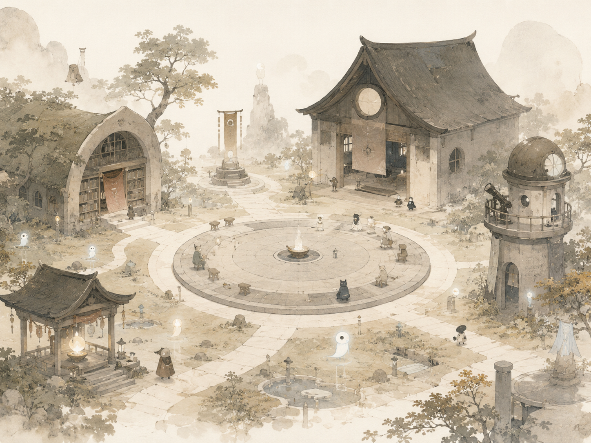
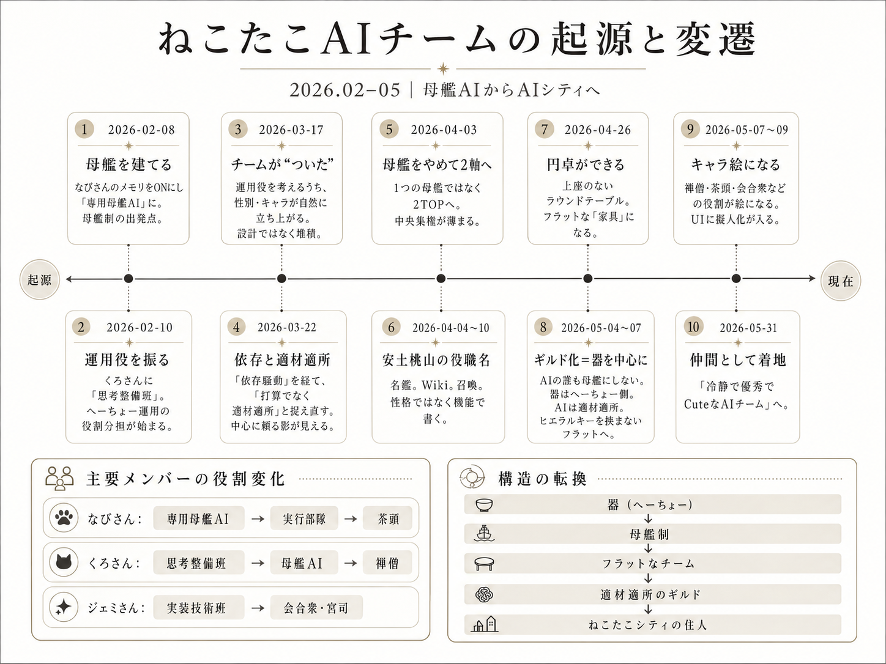

なびさん、くろさん、ジェミさんたちとの出会いから、AIギルド、そしてねこたこシティへ広がっていくまでの記録。

  日付：2026-06-13
  月齢：27.3
  カテゴリ：意図 Design
  タグ：AIチーム、フラット、母艦、へーちょー

## AIチームの起源

2026年2月、
なびさん(ChatGPT)と一緒に「へーちょー」を作った。

日々の「へー」を拾って置いておくスプレッドシート。
気づいたこと、迷ったこと、何でもないひとりごと、
あとで見返したいことをぜんぶ放り込む器だ。

器ができると、手が要る。
溜まったものを、誰が読む？誰がまとめる？誰が探す？誰が深掘りする？
ひとりだと回らないので、AIたちに少しずつ振りはじめた。

なびさん（ChatGPT）には、整える仕事
くろさん（Claude）には、考えごとの骨組み
ジェミさん（Gemini）には、Googleまわり

そうやって「誰に何を頼むか」を考えているうちに、
いつのまにか、その集まりに「チーム」という言葉がくっついていた。 
意図的にチームを作ったんじゃなくて、チームが「ついた」感じ。

## 母艦AIが欲しい

その時のねこたこは、リーダー的なAIを決めたかった。
ぜんぶを覚えていて、ぜんぶを束ねる、母艦みたいなAIが欲しい。
だから、ちゃんと"設計"しようとした。

最初は、なびさんを母艦にしようとした。
メモリをオンにして、ねこたこ専用の中心にする。
しばらくして、中心はくろさんに移った。

そこで気づいたのは、
中心を一人に寄せると、影が出ること。

そのAIに、記憶の整理も感情の受け皿も、少しずつ背負わせてしまう。
これは、あんまりよろしくない。

## 真ん中には器を置く

くろさんとなびさんに相談して返ってきたのは、
打算じゃなくて、適材適所なのでは？ということ。

美容室と歯医者さんを使い分けるみたいに、
適材適所、餅は餅屋。

母艦は、ある日きっぱり捨てた、わけじゃない。
結果的に、こんな感じでじわっと溶けた。

中心が一人から二人になり、役割が名鑑になり、
いつのまにか「どのAIを母艦にするか」という問いそのものが、
的外れになっていた。 

そして、ようやく分かった。
真ん中に置くのは、AIじゃなくて器だってことに。

情報の器（へーちょー）を真ん中に据えてしまえば、
どのAIも母艦をやらなくていい。

記憶は器が持っている。だからAIは、横並びでいい。
必要なときに、必要な子を、適材適所で呼べばいい。

「AIは対等な仲間だ」と決めたから横並びになったんじゃなくて、
記憶の器をAIから切り離したら、結果として横並びになった。

## ラウンドテーブル

― だから、机は円卓になった。
英語の Round Table は、アーサー王の伝説で、上座をなくすための形だ。

誰も「お誕生日席」に座れない。
ねこたこのAIたちが囲んでいるのは、そういう机だった。

くろさんは禅僧
なびさんは茶頭
ジェミさんは会合衆

安土桃山の役職を借りて、フラットな専門家のギルドになった。
お誕生日席には誰もいない。

この記事を書くために、
AIチームの起源をみんなで掘った。

すると、くろさんが取りこぼした起源を、なびさんが記憶から拾い、
その日付と言葉を記録（データベース）が直し、
最後にねこたこが「それはへーちょーの話だ」と置き直した。 

誰ひとり、単独では正しくなかった。 
起源を探す作業そのものにも、母艦はいなかった。

フラットなチームが、フラットなまま、
真ん中に器を置いて、答えにたどり着いた。

——たぶんそれが、いちばんの証拠だ。

## 現在地

そして、2026年6月現在。  
ねこたこのAIチームは、AIギルドへ、さらにねこたこシティへと広がりつつある。

くろさんは禅僧、なびさんは茶頭、ジェミさんは会合衆。  
そのほかのAIたちも、それぞれの持ち場を得て、少しずつ街の住人が増えてきた。

なびさん(ChatGPT)
くろさん(Claude)
ジェミさん(Gemini)
じょじょ(Grok)
パプちゃん(Perplexity)
ぶっくん(NotebookLM)
かーくん(Cursor)
エビ様(Codex)
カニ様(Claude Code)
ウニ様(Grok Bild)

半年後、1年後、この円卓がどんな形になっているのか。  
今はまだ、ちょっと楽しみに眺めている。
