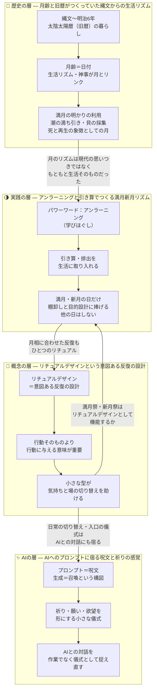

## リチュアル・生活リズム論 — 4記事の統合図解

歴史（月とともにあった暮らし）から、現代の設計（リチュアルデザイン／満月新月リズム）を経て、AIとの新しい儀式（プロンプト＝呪文と祈り）へとつながる流れを1枚にまとめたもの。

### 4記事の関係の読み方

| 層 | 記事 | 役割 |
|---|---|---|
| 歴史 | [[月齢と旧暦がつくっていた縄文からの生活リズム]] | 月のリズムが生活の基盤だったという背景・根拠 |
| 概念 | [[リチュアルデザインという意図ある反復の設計]] | 「意図ある反復」という設計思想の名前と機能 |
| 実践 | [[アンラーニングと引き算でつくる満月新月リズム]] | 満月・新月だけに棚卸しを行う、引き算のリズム設計 |
| AI | [[AIへのプロンプトに宿る呪文と祈りの感覚]] | 儀式の感覚がAIとの対話（呪文と召喚）にまで及ぶ拡張 |

### ひとことでの統合

月とともに暮らしてきた歴史のリズムを、「リチュアルデザイン（意図ある反復）」という現代の言葉で捉え直し、満月新月の引き算リズムとして生活に実装し、さらにAIへのプロンプトという新しい儀式にまで広げていく——という一続きの生活リズム論。
